<p align="center">
  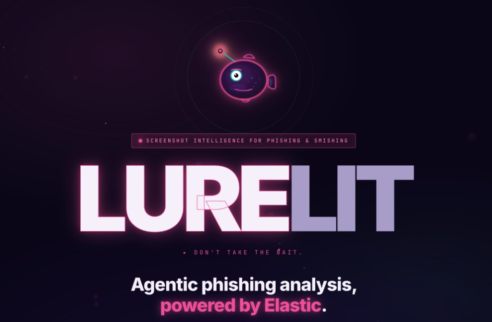
</p>

<p align="center">
  <a href="https://opensource.org/licenses/MIT"></a>
  &nbsp;
  <a href="https://vercel.com/new/clone?repository-url=https%3A%2F%2Fgithub.com%2Fjamesspi%2Flurelit&env=CONFIG_SECRET,SETUP_SECRET&envDescription=CONFIG_SECRET%20encrypts%20stored%20config.%20SETUP_SECRET%20is%20your%20admin%20key%20for%20the%20setup%20wizard.&project-name=lurelit&repository-name=lurelit&stores=%5B%7B%22type%22%3A%22kv%22%7D%5D"></a>
</p>

<p align="center">
  <strong>An agentic screenshot analyzer that lights up phishing and smishing lures.</strong>
</p>

<p align="center">
  <em>Named for the anglerfish's bioluminescent lure — Lurelit illuminates the deceptive glow of phishing attacks, making the invisible threat visible.</em>
</p>

**[Documentation](https://lurelit.ai/docs)** · **[Screenshots](https://lurelit.ai/screenshots)**

---

## Features

- **AI-Powered Classification** — Claude Opus 4.7 vision analyzes screenshots to classify phishing, smishing, spam, or legitimate messages
- **IOC Extraction & Enrichment** — Automatically extracts URLs, domains, IPs, and hashes, then enriches via VirusTotal and urlscan.io
- **Environment Threat Hunting** — ES|QL queries hunt your Elasticsearch data for evidence of extracted IOCs in your org's logs
- **Human-in-the-Loop Approval** — Configurable approval gates before high-cost threat hunting operations
- **Real-Time Progress Tracking** — Live workflow timeline with step-by-step progress and elapsed timers
- **Bulk Analysis** — Submit multiple screenshots in parallel for batch processing
- **Slack Notifications** — Formatted Block Kit reports delivered to your team's Slack channel
- **Cost Tracking** — Token usage and estimated costs displayed for each AI operation
- **History & Metrics** — Full execution history with filtering, stats cards, and trend dashboards

## Quick Start

### From Source

```bash
git clone https://github.com/jamesspi/lurelit.git
cd lurelit
npm install
npm run dev
# Open http://localhost:5001
# Admin key shown in terminal
```

### With Docker

```bash
git clone https://github.com/jamesspi/lurelit.git
cd lurelit
docker compose up
# Open http://localhost:5001
# Admin key shown in container logs: docker compose logs lurelit
```

The default `docker-compose.yml` uses the setup wizard flow:

```yaml
version: '3.8'
services:
  lurelit:
    build: .
    ports:
      - "5001:5001"
    environment:
      - CONFIG_SECRET=change-me-to-a-random-string
      # Uncomment and set these to skip the setup wizard:
      # - KIBANA_URL=https://your-kibana-url
      # - WORKFLOW_ID=your-workflow-id
    volumes:
      - lurelit-data:/app/data
    restart: unless-stopped

volumes:
  lurelit-data:
```

Configuration is saved to the `data/` directory inside the container. The `lurelit-data` Docker volume persists this directory across container rebuilds — running `docker compose down && docker compose up --build` preserves your setup config.

### With Docker + env vars (skip setup wizard)

To skip the wizard entirely, uncomment and set `KIBANA_URL` + `WORKFLOW_ID` in `docker-compose.yml`:

```yaml
    environment:
      - CONFIG_SECRET=change-me-to-a-random-string
      - KIBANA_URL=https://your-kibana:5601
      - WORKFLOW_ID=your-workflow-id
```

When both are set, the app goes straight to the login page — no setup wizard needed. Ideal for pre-configured deployments and CI/CD.

Both methods run on port **5001**. On first launch (without env vars), the setup wizard guides you through connecting to Kibana and configuring your workflow.

### First-Time Setup Walkthrough

On first launch, Lurelit has no configuration and will guide you through an interactive setup wizard:

1. **Admin key displayed in terminal** — On first startup, Lurelit generates a one-time admin key and prints it to the server console/Docker logs. Copy it.
2. **Navigate to `http://localhost:5001/setup`** — The app redirects here automatically when unconfigured.
3. **Enter the admin key** — Paste the key from the terminal to unlock the wizard.
4. **Enter Kibana URL + credentials** — Provide your Kibana instance URL (e.g., `http://localhost:5601`) and a username/password with workflow execution privileges.
5. **Validate connection & prerequisites** — The wizard auto-checks: Kibana connectivity, version (9.4+), Workflows API, Agent Builder, and Security solution.
6. **Review connectors** — The wizard scans for required HTTP connectors (Anthropic API, VirusTotal, urlscan.io) and optional ones (Slack). Create any missing connectors directly from the wizard by entering your API keys.
7. **Select AI models** — Choose which inference endpoints to use for enrichment/hunting (primary) and report formatting (secondary) from your available connectors.
8. **Import or select workflow** — If a matching workflow already exists, select it. Otherwise, import the bundled Lurelit workflow with your configured connectors.
9. **Launch!** — Configuration is encrypted and saved. You're redirected to the login page.
10. **Login with Kibana credentials** — Use the same username/password from step 4.
11. **Start analyzing screenshots** — Upload a screenshot of a suspicious message and get an AI-powered verdict.

### Skipping the Setup Wizard

When environment variables (`KIBANA_URL` + `WORKFLOW_ID`) are set, the app goes straight to the login page — no setup wizard needed. See the "With Docker + env vars" command above. This is ideal for:
- Docker deployments with pre-configured environments
- CI/CD pipelines
- Automated provisioning

Open [http://localhost:5001](http://localhost:5001) and log in with your Kibana credentials.

### Deploy to Vercel

Click the Deploy button above, or manually:

1. Import the repository in [Vercel](https://vercel.com/new)
2. Add **Upstash Redis** from the [Vercel Marketplace](https://vercel.com/marketplace) (this auto-sets `UPSTASH_REDIS_REST_URL` and `UPSTASH_REDIS_REST_TOKEN`)
3. Set environment variables:
   - `CONFIG_SECRET` — required, encrypts stored configuration
   - `SETUP_SECRET` — optional, a fixed admin key for the setup wizard (if omitted, one is generated and stored in Redis)
4. Deploy — visit the URL and run the setup wizard as normal

On Vercel, config, admin key, and avatars all persist in Upstash Redis instead of the filesystem. The setup wizard works identically to self-hosted deployments.

## Prerequisites

| Component | Version | Notes |
|-----------|---------|-------|
| Elastic Stack | 9.4+ | Kibana with Security Workflows GA |
| Agent Builder | Accessible from left nav | Elastic AI Agent with capabilities enabled |
| Node.js | 20+ | For local development |
| Anthropic API | Claude Opus 4.7 | Vision-capable model for screenshot analysis |
| VirusTotal API | v3 | IOC enrichment (free tier works, premium recommended) |
| urlscan.io API | v1 | Domain/URL reputation |

> **Don't have an Elastic cluster yet?** Start a free [Elastic Cloud trial](https://cloud.elastic.co/registration) or use [start-local](https://www.elastic.co/docs/deploy-manage/deploy/self-managed/local-development-installation-quickstart) for quick self-managed testing (a trial license is required for Workflows and Agent Builder features).

## Configuration

### Environment Variables

| Variable | Required | Description |
|----------|----------|-------------|
| `CONFIG_SECRET` | Recommended | Encryption secret for stored config (AES-256-GCM). Must remain consistent across restarts — if changed, previously saved config becomes unreadable. |
| `KIBANA_URL` | No | Full URL to your Kibana instance (no trailing slash). Only needed to skip the setup wizard. |
| `WORKFLOW_ID` | No | Auto-generated workflow ID from Kibana (see docs). Only needed to skip the setup wizard. |

- **`CONFIG_SECRET`** — Set to a random string. Used to encrypt the config file and session cookies. Must stay the same across container restarts; if you change it, you'll need to re-run the setup wizard.
- **`KIBANA_URL` + `WORKFLOW_ID`** — Optional. When both are set, they override any file-based config and skip the setup wizard entirely.

### Config Persistence

Configuration is encrypted and saved to `data/.smish-config.enc`. In Docker, the `lurelit-data` volume mounts at `/app/data`, ensuring config survives `docker compose down && docker compose up --build`. Do not delete the `data/` directory unless you intend to reset configuration.

If the primary `data/` path isn't writable (e.g. permission issues), the app falls back to `/tmp` for temporary storage.

### UI-Based Setup

If env vars aren't set, configure via the setup wizard on first launch, or the Settings modal in the navigation bar. Settings are encrypted and persisted to `data/.smish-config.enc`.

## Securing with HTTPS

Lurelit runs on HTTP by default. For production deployments, TLS should be configured via a reverse proxy.

### Recommended: Nginx Reverse Proxy

```nginx
server {
    listen 443 ssl;
    server_name lurelit.yourdomain.com;

    ssl_certificate /etc/ssl/certs/lurelit.crt;
    ssl_certificate_key /etc/ssl/private/lurelit.key;

    location / {
        proxy_pass http://localhost:5001;
        proxy_set_header Host $host;
        proxy_set_header X-Real-IP $remote_addr;
        proxy_set_header X-Forwarded-For $proxy_add_x_forwarded_for;
        proxy_set_header X-Forwarded-Proto $scheme;
    }
}
```

### Alternative: Caddy (Auto-TLS with Let's Encrypt)

```
lurelit.yourdomain.com {
    reverse_proxy localhost:5001
}
```

Caddy automatically provisions and renews certificates.

### Docker with TLS

```yaml
# docker-compose.yml with Caddy
services:
  lurelit:
    build: .
    ports:
      - "5001:5001"
    environment:
      - KIBANA_URL=https://your-kibana:5601
      - WORKFLOW_ID=your-workflow-id
  caddy:
    image: caddy:alpine
    ports:
      - "443:443"
      - "80:80"
    volumes:
      - ./Caddyfile:/etc/caddy/Caddyfile
    depends_on:
      - lurelit
```

### Important Notes

- When running behind a proxy, session cookies are marked `secure: true` in production (`NODE_ENV=production`)
- Set `NODE_ENV=production` when deploying with TLS
- The `X-Forwarded-Proto` header ensures Lurelit knows it's behind HTTPS
- Native TLS support may be added in a future release

## Workflow Setup

The workflow YAML is included at `workflow/phishing-smishing-screenshot-analyzer.yaml`.

1. Navigate to **Security → Workflows** in Kibana
2. Create a new workflow and switch to the YAML editor
3. Paste the workflow YAML from this project
4. Update all `connector-id` references to match your own connectors
5. Save and enable the workflow
6. Copy the auto-generated **Workflow ID** from the URL and paste it into Lurelit settings

> **Note:** Connector IDs are auto-generated by Kibana. You must create connectors within the Workflows UI and update the YAML references. See the [in-app documentation](/docs) for detailed connector setup guides.

## Architecture

```
┌─────────────────────────────────────────────────────┐
│  Lurelit (Next.js 16 / React 19)                    │
│                                                     │
│  Upload → Submit → Poll Status → Render Results     │
└──────────────────────────┬──────────────────────────┘
                           │ REST API
                           ▼
┌─────────────────────────────────────────────────────┐
│  Kibana Workflows Engine (9.4+)                     │
│                                                     │
│  1. AI Analysis (Anthropic Claude Opus 4.7)         │
│  2. Parse structured classification + IOCs          │
│  3. IOC Enrichment (VirusTotal + urlscan.io)        │
│  4. Summarize enrichment (AI Agent)                 │
│  5. Environment threat hunt (AI Agent + ES|QL)      │
│  6. Final report + Slack notification               │
└─────────────────────────────────────────────────────┘
```

### Tech Stack

- **Next.js 16** — App Router with server-side API routes
- **React 19** — Client components with hooks
- **TypeScript** — Strict mode throughout
- **Tailwind CSS** — Utility classes + custom CSS properties
- **[Elastic Workflows](https://www.elastic.co/docs/explore-analyze/workflows)** — Agentic execution engine
- **[Agent Builder](https://www.elastic.co/docs/explore-analyze/ai-features/elastic-agent-builder)** — AI agent orchestration for threat hunting

### API Routes

| Method | Route | Description |
|--------|-------|-------------|
| POST | `/api/auth/login` | Validate credentials, create session |
| POST | `/api/auth/logout` | Destroy session cookie |
| GET | `/api/auth/me` | Check authentication status |
| POST | `/api/submit` | Submit screenshot for analysis |
| GET | `/api/status/[id]` | Poll execution status & results |
| GET | `/api/history` | List past executions |
| GET | `/api/metrics` | Aggregate threat/safe counts |
| GET/POST | `/api/settings` | Read/save configuration |
| GET | `/api/settings/test` | Test Kibana connectivity |

## Testing

### Example Screenshots

Ready-to-use PNG screenshots are provided in `examples/screenshots/` covering all analysis paths — benign messages, phishing/smishing threats, spam, and HITL trigger scenarios. Upload them directly to Lurelit to validate classification, enrichment, and threat hunting end-to-end.

Screenshots with `real-ioc` in the filename contain IOCs flagged by VirusTotal. Combine them with the seed data script (below) to produce both VT enrichment hits and environment hunt hits.

### Seed Test Data

```bash
# Inject test documents matching IOCs from test screenshots
./scripts/seed-test-data.sh [ELASTICSEARCH_URL] [USERNAME] [PASSWORD]

# Defaults to localhost:9200 with elastic/changeme
./scripts/seed-test-data.sh
```

### Demo Mode

If no Kibana URL or Workflow ID is configured, Lurelit enters demo mode with simulated workflow execution — useful for UI development without a live backend.

## Contributing

1. Fork the repository
2. Create a feature branch (`git checkout -b feature/amazing-feature`)
3. Commit your changes (`git commit -m 'Add amazing feature'`)
4. Push to the branch (`git push origin feature/amazing-feature`)
5. Open a Pull Request

## Screenshots

### Upload & Submission

[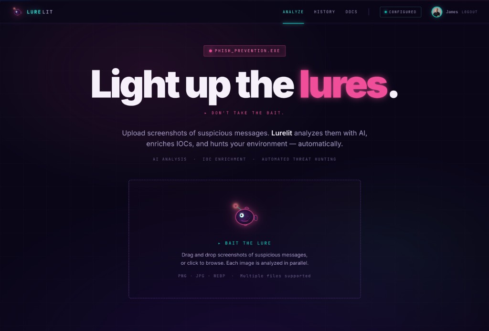](docs/screenshots/upload-hero.png)

[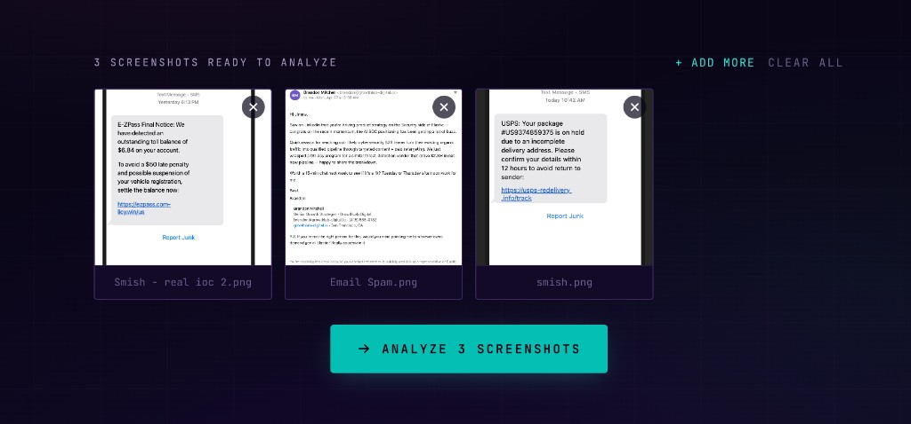](docs/screenshots/multi-file-upload.png)

### Analysis In Progress

[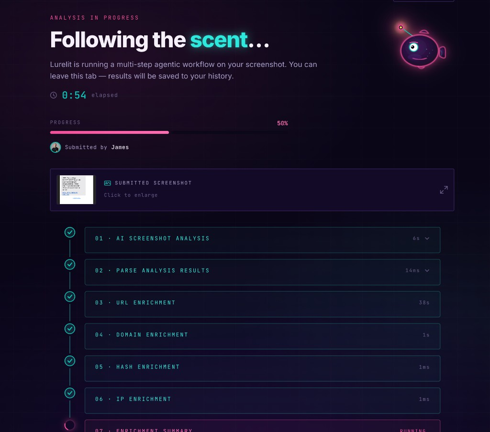](docs/screenshots/analysis-in-progress.png)

[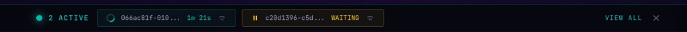](docs/screenshots/active-analyses-bar.png)

### Results & Verdicts

[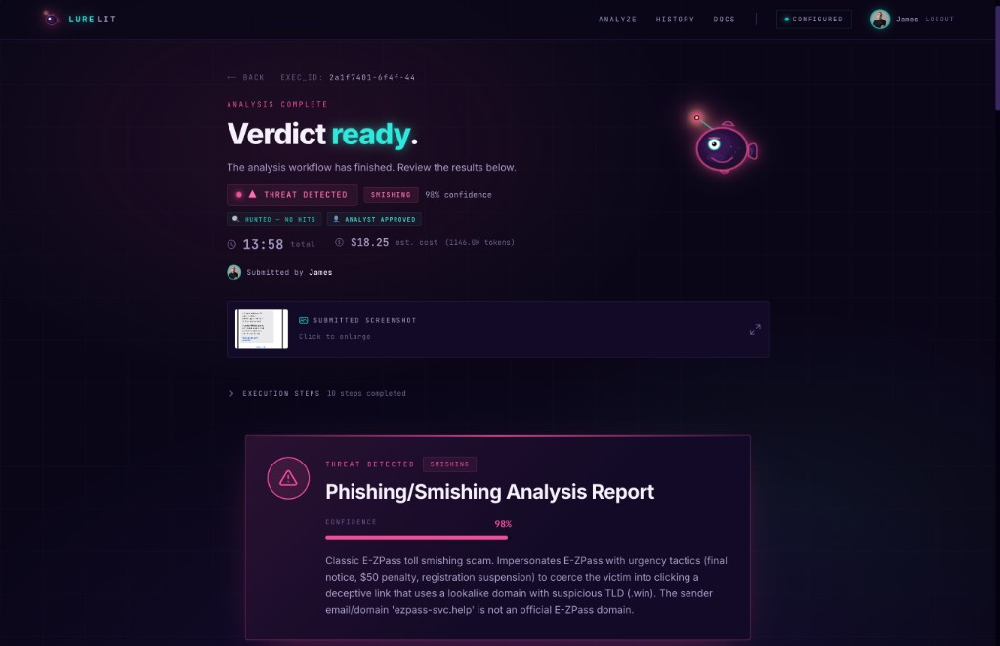](docs/screenshots/results-verdict-header.png)

[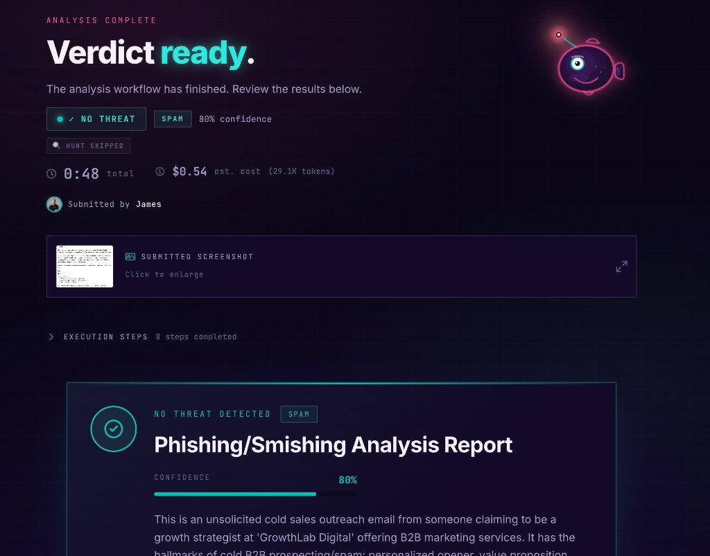](docs/screenshots/result-spam-no-threat.png)

### IOC Enrichment

[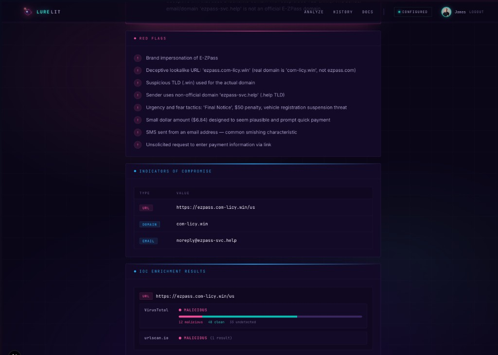](docs/screenshots/ioc-enrichment-results.png)

[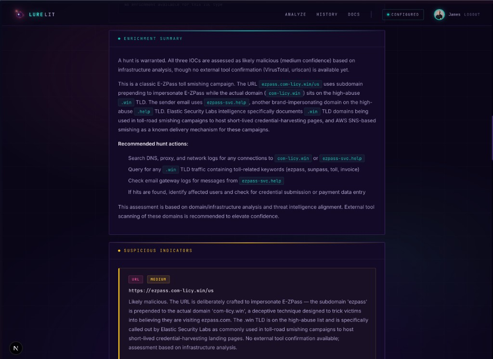](docs/screenshots/enrichment-summary-hunt-recommendations.png)

### Threat Hunting

[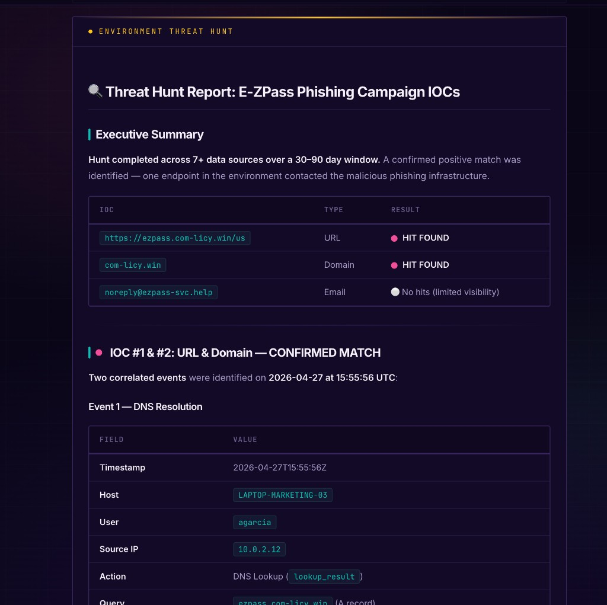](docs/screenshots/threat-hunt-results.png)

### Human-in-the-Loop

[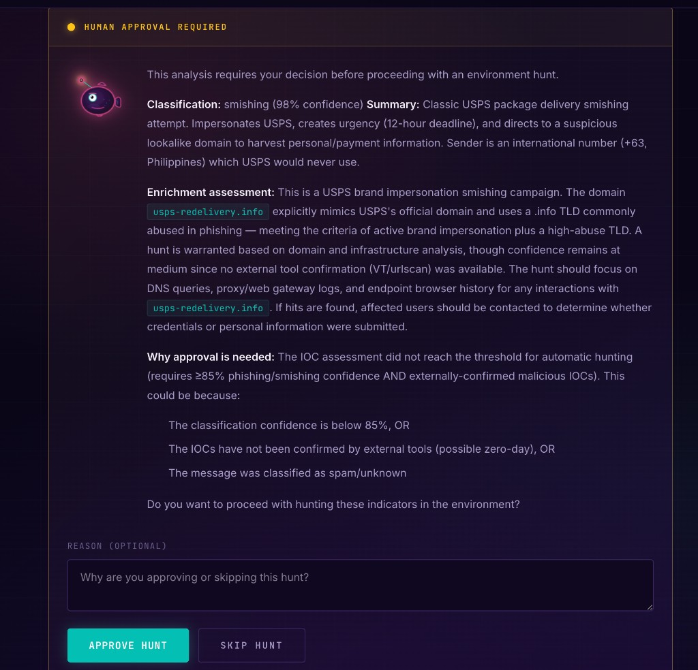](docs/screenshots/hitl-approval-full.png)

[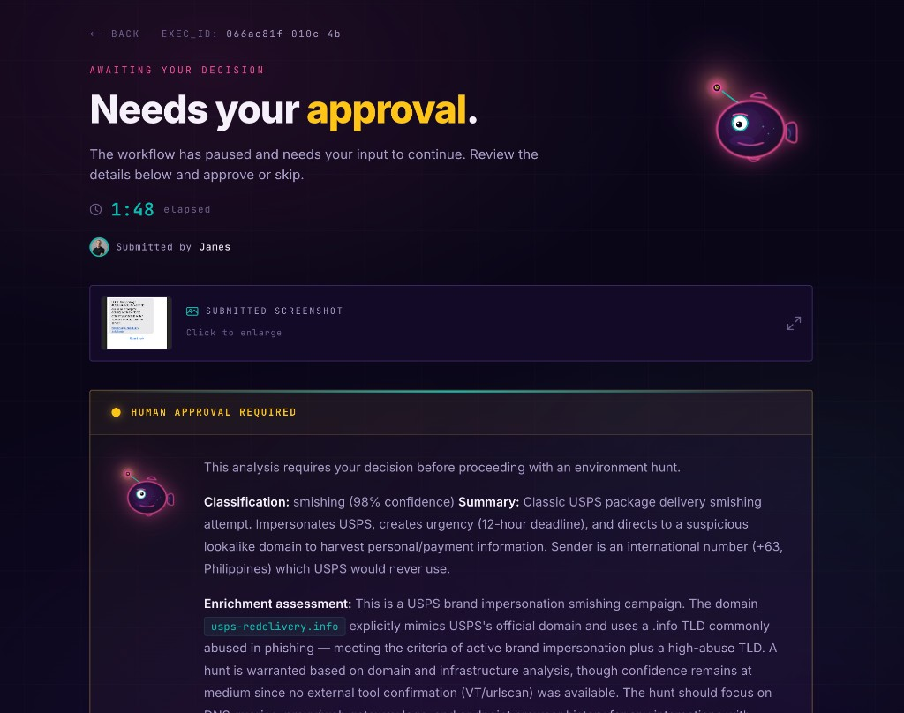](docs/screenshots/hitl-approval-header.png)

### Dashboard & Metrics

[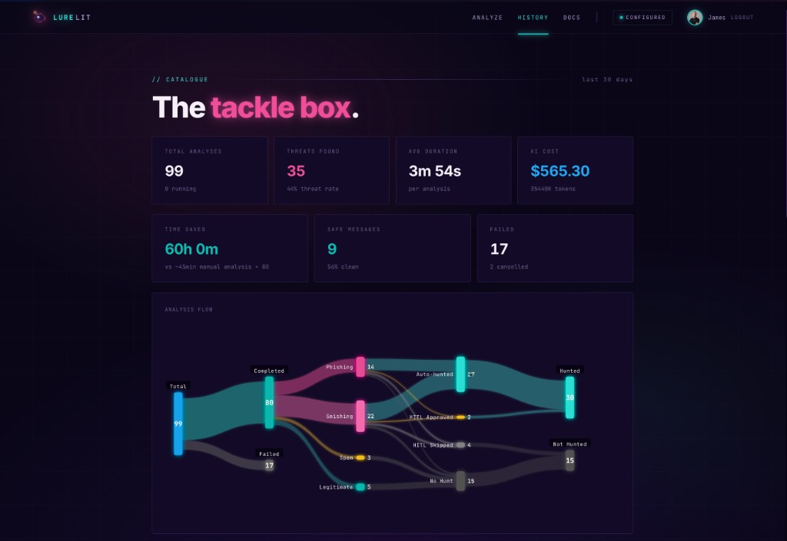](docs/screenshots/dashboard-metrics-sankey.png)

[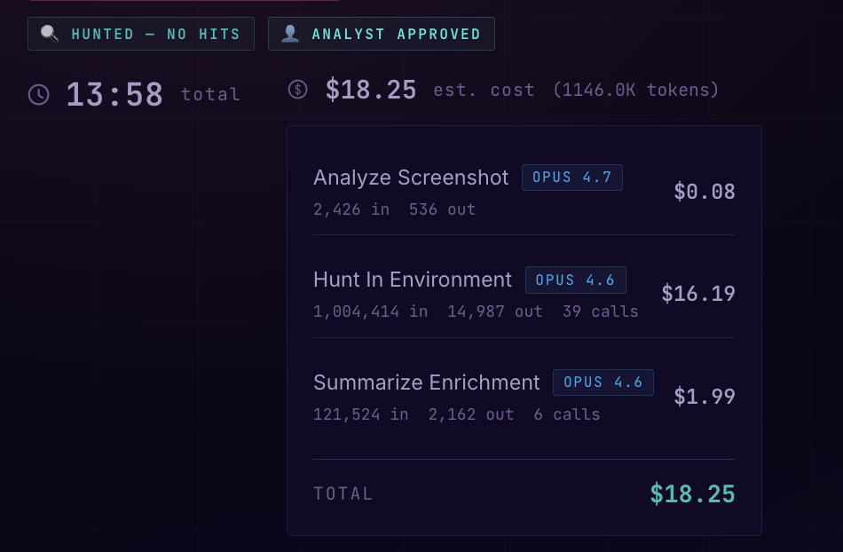](docs/screenshots/cost-breakdown-panel.png)

[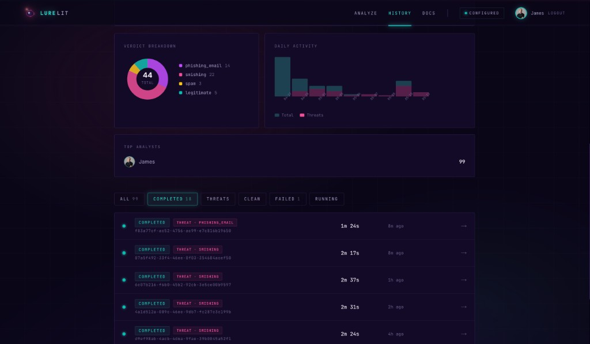](docs/screenshots/history-verdicts-activity.png)

### Notifications

[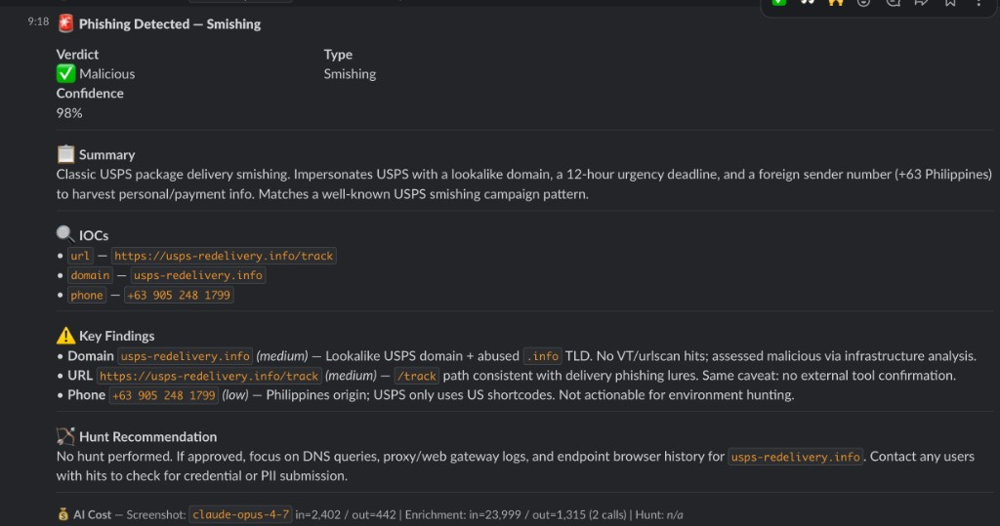](docs/screenshots/slack-notification-kibana.png)

## License

MIT License — see [LICENSE](LICENSE) for details.

---

<p align="center">
  Built by <strong><a href="https://www.linkedin.com/in/jamesspiteri/">James Spiteri</a></strong> · Powered by <strong><a href="https://www.elastic.co/docs/explore-analyze/workflows">Elastic Workflows</a></strong> and <strong><a href="https://www.elastic.co/docs/explore-analyze/ai-features/elastic-agent-builder">Agent Builder</a></strong>
</p>
